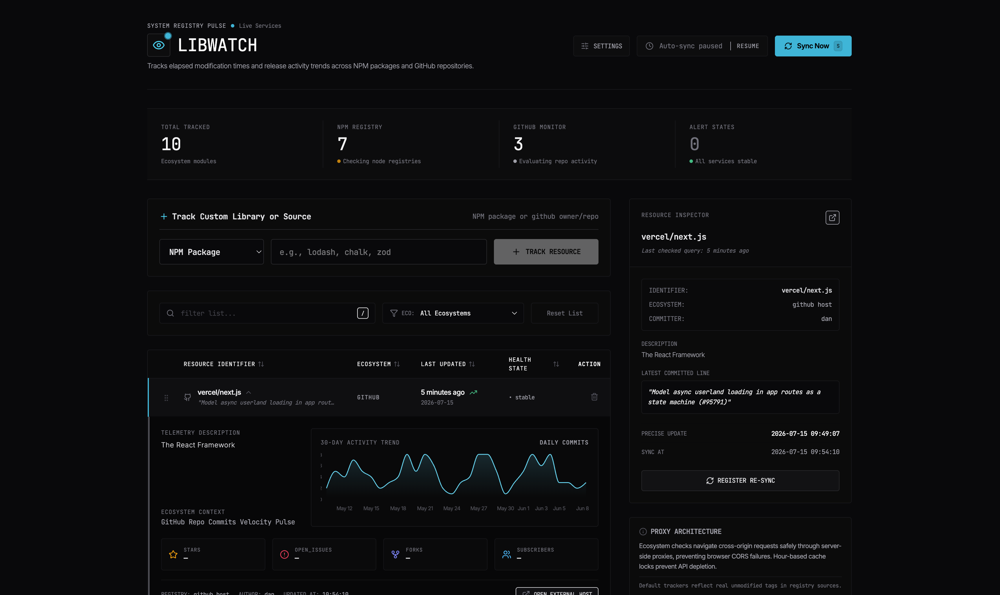
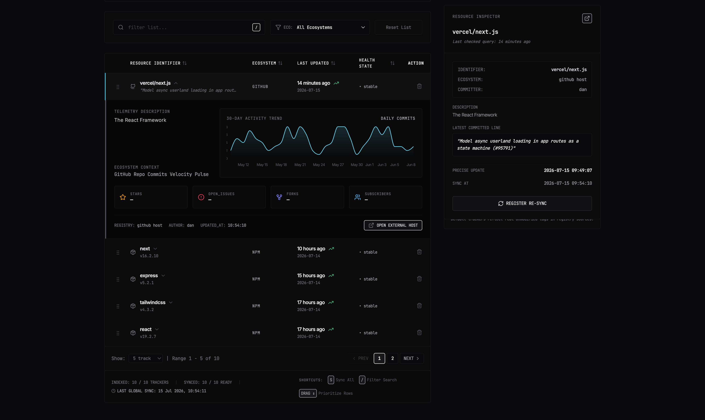

# LibWatch




> Live deployment: **https://libwatch.vercel.app**

LibWatch is a streamlined, high-density monitoring dashboard engineered for software developers to track release activity, last-updated dates, modification tags, and activity velocities across **NPM packages** and **GitHub repositories** — all from a single, always-on surface.

Designed with an aesthetic reminiscent of diagnostic terminals, LibWatch keeps you briefed on critical framework modifications, dependency updates, and core repository commit trends without ever leaving your primary workflow.

---

## Table of Contents

- [What it does](#what-it-does)
- [Key features](#key-features)
- [Technology stack](#technology-stack)
- [Architecture](#architecture)
- [Folder structure](#folder-structure)
- [API reference](#api-reference)
- [Data & caching behavior](#data--caching-behavior)
- [Environment variables](#environment-variables)
- [Local development](#local-development)
- [Production build](#production-build)
- [Deployment](#deployment)
- [Changelog & releases](#changelog--releases)
- [License](#license)

---

## What it does

LibWatch aggregates "last modified" intelligence for the two dependency sources developers care about most:

1. **NPM packages** — watch any package's latest version, last publish date, weekly download count, license, description, and repository size.
2. **GitHub repositories** — watch any repo's latest commit message, author, commit timestamp, star count, fork count, open issues, license, and subscriber count.

The dashboard refreshes automatically on a countdown-driven schedule, caches results for 30 seconds to stay polite to upstream APIs, and visualizes release/commit density with 30-day sparklines so you can spot "activity velocity" at a glance. All tracked entries are stored in your browser's `localStorage`, so nothing is sent to a third-party database.

---

## Key features

- **High-contrast dark aesthetic** — deep-space slate palettes with dynamic accent colors (cyan, emerald, violet, orange, rose) providing distinctive visual feedback.
- **Micro-conversational transitions** — staggered layout entry animations.
- **Auto-sync countdown clock** — active, automated time dials that poll library versions and repository commit pacing continuously; pause and resume with a single click.
- **Resource inspector** — a monospace, YAML-formatted detail panel with instant documentation open triggers and direct endpoint querying.
- **30-day sparkline analytics** — area curves visualizing release frequency and commit density over time.
- **Manual priority sort** — drag-and-drop handles to re-order tracked libraries and establish custom priorities.
- **Global keyboard hotkeys** — configurable in workspace settings: trigger a manual check (`S` by default) or focus the search form (`/` by default).
- **High-density table layout** — sortable columns with expandable lines for quick inspection.

---

## Technology stack

| Layer     | Technology                                   |
| --------- | -------------------------------------------- |
| Frontend  | React 19, TypeScript, Vite, Tailwind CSS 4   |
| Charts    | Recharts                                     |
| Animation | Motion (Framer Motion successor)             |
| Icons     | Lucide React                                 |
| Backend   | Node.js, Express 4                           |
| Hosting   | Vercel (serverless function + static output) |

---

## Architecture

LibWatch is a full-stack application served from a single Express server in two modes:

- **Development** — `server.ts` boots Vite middleware alongside the Express API, giving you HMR and the `/api/*` routes together on one port.
- **Production** — the frontend is pre-built by Vite and served statically, while the Express API runs as a serverless function (`api/index.ts`) on Vercel.

The Express app itself lives in `app.ts` (`createApp()`), which is shared by:

- `server.ts` — the local long-running server (adds the Vite dev middleware and `app.listen`).
- `api/index.ts` — the Vercel serverless wrapper (lazily builds the app once per instance and forwards each request).

Requests flow:

```
Browser (React SPA)
      │
      ▼
https://libwatch.vercel.app/
      │
      ├── /  or  /assets/*  ────────────────►  Static files (Vite build output)
      └── /api/npm-update                    └──►  Vercel serverless function
          /api/github-update
                  │
                  ▼
            Upstream APIs
        (registry.npmjs.org, api.npmjs.org,
         api.github.com)
```

---

## Folder structure

```text
.
├── api/
│   └── index.ts                 # Vercel serverless entry (wraps createApp)
├── assets/                      # Screenshots used in this README
├── dist/                        # Build output (generated)
├── src/
│   ├── types.ts                 # TypeScript type declarations
│   ├── utils.ts                 # Date formatting & trend data generators
│   ├── main.tsx                 # React application entry
│   ├── App.tsx                  # Main coordinating React component
│   └── components/
│       ├── theme.ts             # Visual accent/theme presets
│       ├── Tooltip.tsx          # Custom React Portal tooltip
│       ├── Header.tsx           # Title, countdown clock, sync control
│       ├── StatsOverview.tsx    # High-level dashboard stat cards
│       ├── AddLibraryForm.tsx   # Package/repo tracking selector + toasts
│       ├── SettingsDrawer.tsx   # Sliders, keybinds, tone chimes, accents
│       ├── LibraryTable.tsx     # Sortable columns, drag handles, sparklines
│       └── SidebarInspector.tsx # YAML-format resource inspector
├── app.ts                      # Express app factory (API routes + static)
├── server.ts                   # Local dev/prod server entry
├── vercel.json                 # Vercel build & routing config
├── package.json
├── tsconfig.json
└── vite.config.ts
```

---

## API reference

### `GET /api/npm-update?package=<name>`

Fetches release metadata for an NPM package.

| Query param | Type   | Required | Description                  |
| ----------- | ------ | -------- | ---------------------------- |
| `package`   | string | yes      | NPM package name, e.g. `react` |

Example:

```bash
curl "https://libwatch.vercel.app/api/npm-update?package=express"
```

```json
{
  "name": "express",
  "type": "npm",
  "lastUpdated": "2026-08-15T20:58:49.104Z",
  "latestVersion": "5.2.1",
  "description": "Fast, unopinionated, minimalist web framework",
  "homepage": "https://expressjs.com/",
  "downloads": 71992983,
  "license": "MIT",
  "size": 12,
  "openIssues": 23,
  "stars": 511,
  "source": "live"
}
```

### `GET /api/github-update?repo=<owner/repo>`

Fetches release/commit metadata for a GitHub repository.

| Query param | Type   | Required | Description                          |
| ----------- | ------ | -------- | ------------------------------------ |
| `repo`      | string | yes      | Repository in `owner/repo` format    |

Example:

```bash
curl "https://libwatch.vercel.app/api/github-update?repo=vercel/next.js"
```

```json
{
  "name": "vercel/next.js",
  "type": "github",
  "lastUpdated": "2026-09-11T11:46:40Z",
  "commitMessage": "[ci] Show full logs under GitHub Actions debug logging (#98501)",
  "authorName": "Sebastian \"Sebbie\" Silbermann",
  "homepage": "https://github.com/vercel/next.js",
  "stars": 142234,
  "forks": 31905,
  "openIssues": 3340,
  "subscribers": 8678,
  "license": "MIT",
  "size": 1,
  "description": "The React Framework",
  "source": "live"
}
```

> The `size` field for GitHub repos is reported in KB by the GitHub API; very large repos may exceed the API's integer precision and appear small.

---

## Data & caching behavior

- Both endpoints cache results in an in-memory Map for **30 seconds** (`CACHE_TTL_MS`).
- Responses include a `source` field: `"live"` when fetched fresh from upstream, `"cache"` when returned from the in-memory cache.
- The GitHub route fetches the latest commit and repository metadata in parallel.
- The GitHub route sends a `User-Agent` header (required by GitHub) and automatically attaches an auth token when `GITHUB_TOKEN` is set, which dramatically raises the API rate limit.

---

## Environment variables

| Variable       | Required | Default | Description                                                    |
| -------------- | -------- | ------- | -------------------------------------------------------------- |
| `PORT`         | no       | `3000`  | HTTP port for the local Express server                         |
| `NODE_ENV`     | no       | —       | `production` disables the Vite dev middleware                  |
| `GITHUB_TOKEN` | no       | —       | GitHub Personal Access Token; lifts the GitHub API rate limit  |

Create a `.env` file for local development:

```env
PORT=3000
NODE_ENV=development
# GITHUB_TOKEN=ghp_xxx
```

---

## Local development

```bash
# 1. Install dependencies
npm install

# 2. Start the dev server (Express + Vite with HMR)
npm run dev
# → http://localhost:3000

# 3. Lint / type-check
npm run lint

# 4. Run tests if added
npm run test
```

## Production build

```bash
npm run build
npm start
```

`npm run build` internally runs:

```bash
vite build                                  # builds the React frontend → dist/
esbuild server.ts --bundle --format=esm     # bundles the API server → dist/server.mjs
```

---

## Deployment

### Vercel (recommended)

The repository ships with `vercel.json`, which:

- Builds both frontend and API (`npm run build`).
- Serves the Vite output in `dist/` as static assets.
- Routes `/api/*` to the Express serverless function.

Deploy with:

```bash
npm i -g vercel        # if needed
vercel login
vercel deploy --prod
```

On the Vercel Dashboard, add a `GITHUB_TOKEN` environment variable to the production environment to raise the GitHub API rate limit. Optionally connect the GitHub repository and enable **Auto Deploy** so every push to `main` ships automatically.

Alias: **https://libwatch.vercel.app**

### Any Node host (self-hosted)

The app runs as a plain Node server, so it also works on Render, Railway, Fly.io, or any box with Node 20+:

```bash
npm install
npm run build
PORT=3000 NODE_ENV=production npm start
```

---

## Changelog & releases

All notable changes are documented in [CHANGELOG.md](./CHANGELOG.md), and stable snapshots are published as [GitHub Releases](../../releases).

---

## License

Built in a sandboxed developer workspace for high-productivity library monitoring. All data is stored inside local browser storage (`localStorage`), guaranteeing immediate privacy.